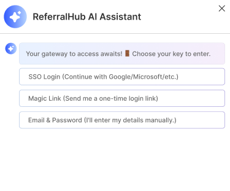

# ReferralHub - Modern Referral Management Platform

A modern, full-featured referral management platform built with React and TypeScript. ReferralHub helps businesses manage their referral campaigns, track promoters, and handle rewards efficiently.



## Features

- 🤖 AI-powered campaign assistance
- 📊 Comprehensive dashboard with real-time analytics
- 💰 Advanced payout management system
- 👥 Promoter relationship management
- 📈 Campaign creation and tracking
- 🎯 Lead management and conversion tracking
- ⚙️ Customizable platform settings
- 🔐 Secure authentication system

## Tech Stack

- React 18.2.0
- TypeScript 4.9.5
- Styled Components 6.1.17
- React Router DOM 6.30.0
- React Icons 5.5.0
- Axios for API communication

## Prerequisites

Before you begin, ensure you have installed:

- Node.js (v14 or higher)
- npm (v6 or higher)

## Installation

1. Clone the repository

```bash
git clone https://github.com/ANGADKUMAR1111/hackathon-frontend
cd hackathon-frontend
```

2. Install dependencies

```bash
npm install
```

3. Create a .env file in the root directory and add necessary environment variables

```bash
REACT_APP_API_URL=your_api_url_here
```

4. Start the development server

```bash
npm start
```

The application will open in your default browser at `http://localhost:3000`.

## Project Structure

```
src/
├── components/       # Reusable UI components
├── pages/           # Page components
├── services/        # API and other services
├── styles/          # Global styles and theme
└── types/          # TypeScript type definitions
```

## Available Scripts

- `npm start` - Runs the app in development mode
- `npm test` - Launches the test runner
- `npm run build` - Builds the app for production
- `npm run eject` - Ejects from create-react-app

## Key Features Breakdown

### AI Agent

- Smart campaign recommendations
- Automated response handling
- Customizable AI behavior

### Platform Setup

- Step-by-step onboarding process
- Integration configurations
- Business profile setup

### Campaign Management

- Create and manage referral campaigns
- Track campaign performance
- Configure rewards and points

### Payout System

- Multiple payment method support
- Automated reward distribution
- Dispute management

### Promoter Management

- Promoter profiles
- Performance tracking
- Communication tools

## Contributing

1. Fork the repository
2. Create your feature branch (`git checkout -b feature/AmazingFeature`)
3. Commit your changes (`git commit -m 'Add some AmazingFeature'`)
4. Push to the branch (`git push origin feature/AmazingFeature`)
5. Open a Pull Request

## License

This project is licensed under the MIT License - see the LICENSE file for details.

## Contact

Your Name - [@ANGAD KUMAR](https://www.linkedin.com/in/angad-kumar-95a367251/)
Project Link: [https://github.com/ANGADKUMAR1111/hackathon-frontend](https://github.com/ANGADKUMAR1111/hackathon-frontend)

## Acknowledgments

- [React](https://reactjs.org/)
- [TypeScript](https://www.typescriptlang.org/)
- [Styled Components](https://styled-components.com/)
- [React Router](https://reactrouter.com/)
